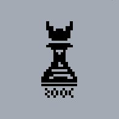

<div align="center">
  <h1><code>ROOC</code></h1>
  
  <p><strong>Optimization modeling language</strong></p>
</div>

[](https://crates.io/crates/rooc)
[](https://www.npmjs.com/package/@specy/rooc)

[Go to the language documentation](https://rooc.specy.app/docs/rooc)

[Go to the library documentation](https://rooc.specy.app/docs/rooc)

[Go to the rooc web modeling platform](https://rooc.specy.app/)


**ROOC** stands for the courses I took in university—*Ricerca Operativa* (Operational Research) and *Ottimizzazione Combinatoria* (Combinatorial Optimization)—which deal with solving optimization models.

# What it is
**ROOC** is a modeling language designed to write formal optimization models, and together with data, transform it into a linear model which can then be solved using optimization techniques. 

The language provides support for defining formal models, including functions, constants, arrays, graphs, tuples, etc... It also includes built-in utility functions for iterating over graphs, edges, arrays, ranges, and more.

If you just want to solve a problem, you can use the [web platform](https://rooc.specy.app) or implement your own through the [rust lib](https://crates.io/crates/rooc) or [typescript lib](https://www.npmjs.com/package/@specy/rooc)
# Examples

For examples of models [look in the rooc docs](https://rooc.specy.app/docs/rooc/examples)

Here is an example of the knapsack problem modeled in ROOC and solved through the rust library.

It shows most of the feature of the library and language, adding data, and solving the model with a binary solver
```rust
    let source = "
    max sum((value, i) in enumerate(values)) { value * x_i }
    s.t.
        sum((weight, i) in enumerate(weights)) { weight * x_i } <= capacity
    define
        x_i as Boolean for i in 0..len(weights)";

    let constants = vec![
        Constant::from_primitive(
            "weights",
            IterableKind::Integers(vec![10, 60, 30, 40, 30, 20, 20, 2]).into_primitive(),
        ),
        Constant::from_primitive(
            "values",
            IterableKind::Integers(vec![1, 10, 15, 40, 60, 90, 100, 15]).into_primitive(),
        ),
        Constant::from_primitive("capacity", Primitive::Integer(102)),
    ];
    //in case you want to define your own functions that will be used during compilation
    let fns: FunctionContextMap = IndexMap::new();


    let solver = RoocSolver::try_new(source.to_string()).unwrap();

    //use the built in solvers or make your own
    let solution = solver
        .solve_with_data_using(solve_binary_lp_problem, constants, &fns)
        .unwrap();

    println!("{}", solution);
```


For more examples of using the rust lib look at the [examples folder](https://github.com/Specy/rooc/tree/main/examples)


## Solvers
Currently in ROOC you can solve any linear models which can be:
- MILP
- Integer or binary only
- Binary only
- Real only 

# Modeling Example
Given the formal model of the [Dominating set](https://en.wikipedia.org/wiki/Dominating_set) problem, let's model it using graphs:
```lua
min sum(u in nodes(G)) { x_u }
s.t. 
    x_v + sum((_, u) in neigh_edges(v)) { x_u } >= 1 for v in nodes(G)
where
    let G = Graph {
        A -> [B, C, D, E, F],
        B -> [A, E, C, D, J],
        C -> [A, B, D, E, I],
        D -> [A, B, C, E, H],
        E -> [A, B, C, D, G],
        F -> [A, G, J],
        G -> [E, F, H],
        H -> [D, G, I],
        I -> [C, H, J],
        J -> [B, F, I]
    }
define
    x_u, x_v as Boolean for v in nodes(G), (_, u) in neigh_edges(v)
```
It is compiled down to:
```lua
min x_A + x_B + x_C + x_D + x_E + x_F + x_G + x_H + x_I + x_J
s.t.
        x_A + x_B + x_D + x_C + x_F + x_E >= 1
        x_B + x_D + x_E + x_J + x_C + x_A >= 1
        x_C + x_B + x_D + x_I + x_A + x_E >= 1
        x_D + x_E + x_H + x_C + x_A + x_B >= 1
        x_E + x_B + x_D + x_C + x_A + x_G >= 1
        x_F + x_J + x_G + x_A >= 1
        x_G + x_E + x_F + x_H >= 1
        x_H + x_D + x_I + x_G >= 1
        x_I + x_J + x_H + x_C >= 1
        x_J + x_F + x_I + x_B >= 1
```
The model can then be solved using the `Binary solver` pipeline, which will solve the compiled model and find the optimal solution which has value `3` with assignment:
```
F	F	F	F	T	F	F	F	T	T
```

# Implemented Features 
- [x] Language
  - [x] Static block functions (min, max, mod, avg)
  - [x] Constant Graph definitions
  - [x] Iterators
  - [x] Tuples
  - [x] Iterators utility functions (for graphs, edges, etc)
  - [x] Primitive destructuring
  - [x] Constants and multi dimensional arrays in the formal definition of a problem
  - [x] Other utility functions
  - [x] Error logging and parameter validation 
  - [x] Error traces
  - [x] Primitives Operator overloading (for example, `+` for strings)
  - [x] Definition of variable bounds
  - [x] Javascript defined functions, define js functions to use in the model
- [x] Simplex resolution
  - [x] Linearization of a generic problem (done except for mod operator)
  - [x] Transformation of a linear problem into the standard form
  - [x] Two step method using artifical variables to find a valid basis for the standard form problem
  - [x] Simplex to find the optimal solution of a standard form linear problem
- [ ] Integer and binary problems resolution
  - [x] Integer and binary problem definitions (bounds)
  - [x] Integer solvers
  - [x] Binary problem solution
  - [x] Integer/Binary problem solution
  - [x] MILP problem solution
  - [ ] Logic constraints
- [x] UI
  - [x] Compilation to WASM
  - [x] Create and manage your models
  - [x] Automatic compilation to a LATEX block
  - [x] LSP
    - [x] Syntax errors
    - [x] Hover types
    - [x] Type errors
    - [x] Code completion
  - [x] Language documentation 
  - [x] Show the different steps of solving the problem
  - [x] List of modifications from the start of the problem to the end of the solution

