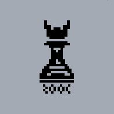

<div align="center">
  <h1><code>ROOC</code></h1>
  
  <p><strong>Optimization modeling language</strong></p>
</div>

[](https://crates.io/crates/rooc)
[](https://www.npmjs.com/package/@specy/rooc)

[Go to the language documentation](https://rooc.specy.app/docs/rooc)

[Go to the library documentation](https://rooc.specy.app/docs/rooc)

[Go to the rooc web modeling platform](https://rooc.specy.app/)


**ROOC** stands for the courses I took in university—*Ricerca Operativa* (Operational Research) and *Ottimizzazione Combinatoria* (Combinatorial Optimization)—which deal with solving optimization models.

# What it is
**ROOC** is a modeling language designed to write formal optimization models, and together with data, transform it into a linear model which can then be solved using optimization techniques. 

The language provides support for defining formal models, including functions, constants, arrays, graphs, tuples, etc... It also includes built-in utility functions for iterating over graphs, edges, arrays, ranges, and more.

If you just want to solve a problem, you can use the [web platform](https://rooc.specy.app) or implement your own through the [rust lib](https://crates.io/crates/rooc) or [typescript lib](https://www.npmjs.com/package/@specy/rooc)
# Examples

For examples of models [look in the rooc docs](https://rooc.specy.app/docs/rooc/examples)

Here is an example of the knapsack problem modeled in ROOC and solved through the rust library.

It shows most of the feature of the library and language, adding data, and solving the model with a MILP solver
```rust
    let source = "
    max sum((value, i) in enumerate(values)) { value * x_i }
    s.t.
        sum((weight, i) in enumerate(weights)) { weight * x_i } <= capacity
    define
        x_i as Boolean for i in 0..len(weights)";

    let constants = vec![
        Constant::from_primitive(
            "weights",
            IterableKind::Integers(vec![10, 60, 30, 40, 30, 20, 20, 2]).into_primitive(),
        ),
        Constant::from_primitive(
            "values",
            IterableKind::Integers(vec![1, 10, 15, 40, 60, 90, 100, 15]).into_primitive(),
        ),
        Constant::from_primitive("capacity", Primitive::Integer(102)),
    ];
    //in case you want to define your own functions that will be used during compilation
    let fns: FunctionContextMap = IndexMap::new();


    let solver = RoocSolver::try_new(source.to_string()).unwrap();

    //use the built in solvers or make your own
    let solution = solver
        .solve_with_data_using(solve_milp_lp_problem, constants, &fns)
        .unwrap();

    println!("{}", solution);
```


For more examples of using the rust lib look at the [examples folder](https://github.com/Specy/rooc/tree/main/examples)


## Solvers
Currently in ROOC you can solve any linear models which can be:
- MILP (Real, integer, and binary variables)
- Real only 

# Modeling Example
Given the formal model of the [Dominating set](https://en.wikipedia.org/wiki/Dominating_set) problem, let's model it using graphs:
```lua
min sum(u in nodes(G)) { x_u }
s.t. 
    x_v + sum((_, u) in neigh_edges(v)) { x_u } >= 1 for v in nodes(G)
where
    let G = Graph {
        A -> [B, C, D, E, F],
        B -> [A, E, C, D, J],
        C -> [A, B, D, E, I],
        D -> [A, B, C, E, H],
        E -> [A, B, C, D, G],
        F -> [A, G, J],
        G -> [E, F, H],
        H -> [D, G, I],
        I -> [C, H, J],
        J -> [B, F, I]
    }
define
    x_u, x_v as Boolean for v in nodes(G), (_, u) in neigh_edges(v)
```
It is compiled down to:
```lua
min x_A + x_B + x_C + x_D + x_E + x_F + x_G + x_H + x_I + x_J
s.t.
        x_A + x_B + x_D + x_C + x_F + x_E >= 1
        x_B + x_D + x_E + x_J + x_C + x_A >= 1
        x_C + x_B + x_D + x_I + x_A + x_E >= 1
        x_D + x_E + x_H + x_C + x_A + x_B >= 1
        x_E + x_B + x_D + x_C + x_A + x_G >= 1
        x_F + x_J + x_G + x_A >= 1
        x_G + x_E + x_F + x_H >= 1
        x_H + x_D + x_I + x_G >= 1
        x_I + x_J + x_H + x_C >= 1
        x_J + x_F + x_I + x_B >= 1
```
The model can then be solved using the `MILP solver` or `Auto solver` pipeline, which will solve the compiled model and find the optimal solution which has value `3` with assignment:
```
F	F	F	F	T	F	F	F	T	T
```

# Logic constraints
Models can use logic operators over boolean expressions: `and` (alias `&&`), `or` (alias `||`), `not` (alias `!`), `implies` (alias `->`), `iff` (alias `<->`) and `xor`, together with the indexed aggregations `all`, `any` and `xor`. A constraint written without a comparison asserts that the logic expression must hold, and a logic expression can also be used as a 0/1 value inside arithmetic (for example to count how many conditions are satisfied).

Assertions are compiled directionally: affine clauses are emitted directly, while complex branches use only the Boolean witnesses needed to certify the asserted truth value. Logic expressions used inside arithmetic remain exact in both directions. Consequently, each edge clause in the vertex-cover model below becomes one linear row and does not require a root `$or_N` variable.

Here is the [Vertex cover](https://en.wikipedia.org/wiki/Vertex_cover) problem, where the only constraint is the logic clause "at least one endpoint of each edge must be selected":
```lua
min sum(v in nodes(G)) { x_v }
s.t.
    x_u or x_v for (u, v) in edges(G)
where
    let G = Graph {
        A -> [B, C],
        B -> [D],
        C -> [D],
        D -> [E],
        E
    }
define
    x_v as Boolean for v in nodes(G)
```

## Context-aware `abs`, `min` and `max`

The absolute value is available as the `abs { }` block, e.g. `min abs { x - 5 }`. Numeric piecewise expressions inspect how their value is consumed. A favorable one-sided context uses the smaller epigraph or hypograph formulation and can preserve a pure LP. An opposite-direction or equality context uses an exact formulation with Boolean selectors.

```lua
max abs { x }
s.t.
    -10 <= x
    x <= 6
define
    x as Real
```

Here the compiler infers `x in [-10, 6]` and derives the exact selector coefficients from that interval. It never inserts an arbitrary Big-M constant. Bounds can come from declarations, affine constraints, and safe implications such as `abs { x } <= c`, `max { ... } <= c` and `min { ... } >= c`. If an exact formulation needs an endpoint that cannot be proven finite, linearization reports an error asking for bounds instead of producing an unsafe model. Sign-known absolute values and dominated `min`/`max` operands are removed without auxiliaries.

## Migrating to `@specy/rooc` 2.0

Version 2.0 makes the logic and absolute-value syntax unambiguous. Replace the removed `|x|` form with `abs { x }`; `||` is now the symbolic alias for `or`. The words `and`, `or`, `not`, `implies`, `iff`, `xor`, `true` and `false` are reserved by the language.

Serialized models now use a consistent adjacent-tagged expression shape, `{ type, value }`. Tuple expression variants such as `Xor`, `Implies`, `Iff`, `BinOp` and `UnOp` store their fields in the typed `value` tuple. Constraints also expose `is_logic_assertion`, which distinguishes a bare assertion from an explicit comparison such as `flag = true`.

For TypeScript consumers, use the public `@specy/rooc/runtime` and `@specy/rooc/pkg` subpaths. Imports through internal paths such as `@specy/rooc/dist/pkg/rooc` are no longer supported.

Since 2.1, compiler-generated rows are unnamed: the compiled linear model only shows constraint names that appear in the source, and serialized generated rows have an empty `name`. Duplicated user names get a `__{n}` suffix instead of `#{n}`.

Compiled output is itself valid ROOC source: identifiers may start with underscores, `__` inside a name is a literal fragment, and unbound identifier indexes such as `x_A` resolve to the literal variable name, so a compiled model can be pasted back in and solved again.

# Implemented Features 
- [x] Language
  - [x] Static block functions (min, max, avg, abs)
  - [x] Logic operators (and, or, not, implies, iff, xor) and aggregations (all, any, xor)
  - [x] Constant Graph definitions
  - [x] Iterators
  - [x] Tuples
  - [x] Iterators utility functions (for graphs, edges, etc)
  - [x] Primitive destructuring
  - [x] Constants and multi dimensional arrays in the formal definition of a problem
  - [x] Other utility functions
  - [x] Error logging and parameter validation 
  - [x] Error traces
  - [x] Primitives Operator overloading (for example, `+` for strings)
  - [x] Definition of variable bounds
  - [x] Javascript defined functions, define js functions to use in the model
- [x] Simplex resolution
  - [x] Linearization of a generic problem (min, max, abs, logic operators)
  - [x] Transformation of a linear problem into the standard form
  - [x] Two step method using artifical variables to find a valid basis for the standard form problem
  - [x] Simplex to find the optimal solution of a standard form linear problem
- [x] Integer and binary problems resolution
  - [x] Integer and binary problem definitions (bounds)
  - [x] Integer solvers
  - [x] Binary problem solution
  - [x] Integer/Binary problem solution
  - [x] MILP problem solution
  - [x] Logic constraints
- [x] UI
  - [x] Compilation to WASM
  - [x] Create and manage your models
  - [x] Automatic compilation to a LATEX block
  - [x] LSP
    - [x] Syntax errors
    - [x] Hover types
    - [x] Type errors
    - [x] Code completion
  - [x] Language documentation 
  - [x] Show the different steps of solving the problem
  - [x] List of modifications from the start of the problem to the end of the solution

# License

- The rooc library is released with the **MPL-2.0** license, as in, the folders `src` and `ts-lib`
- The frontend platform which uses the rooc library is released with the **AGPL-3.0** license, as in, the folder `frontend`
